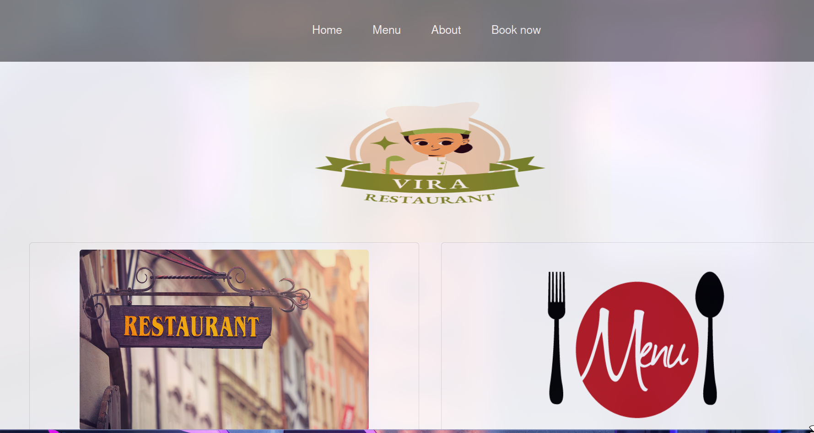
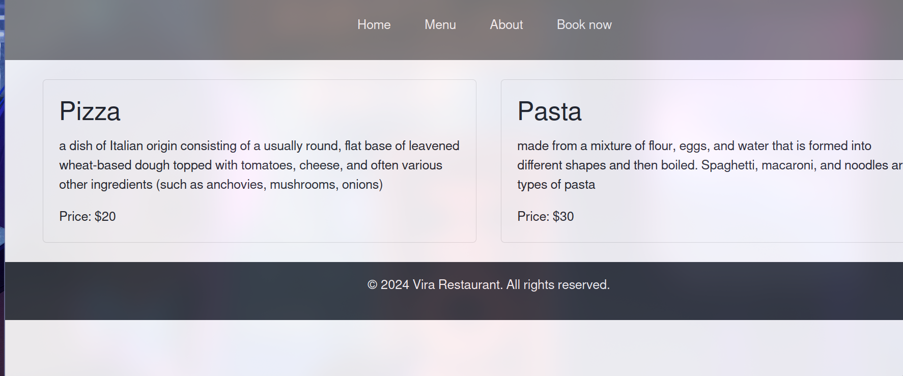
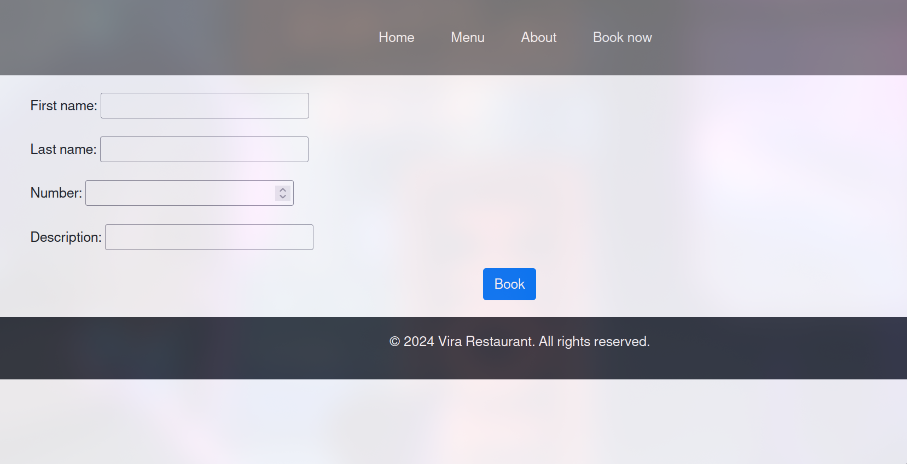

## Django Project 

A resturant called vira have an app to display their menu as well as to get the bookings from the client 

* create a virtual env then install django  *

* python manage.py makemigrations *
* python manage.py migrate *
* python manage.py runserver *

